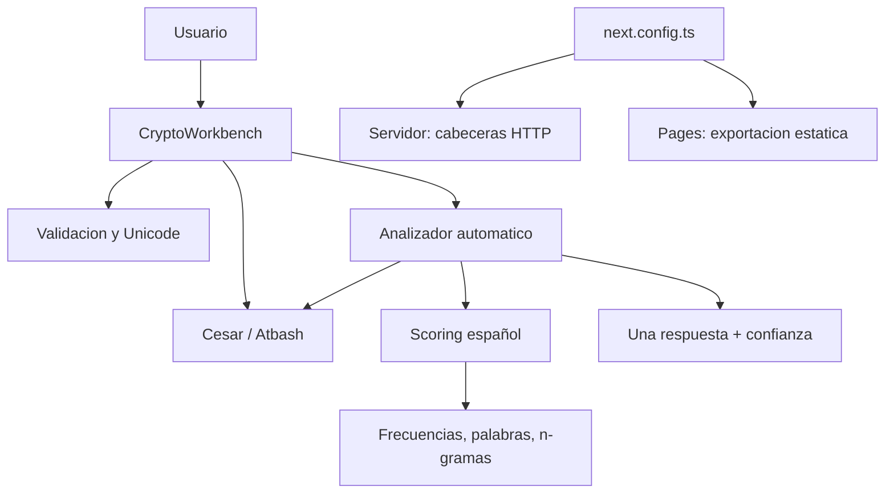

# Vision general del proyecto

## ¿Que hace?

Es un laboratorio web local que cifra mensajes con Cesar o Atbash sobre un conjunto Unicode ordenado y descifra automaticamente textos producidos por esos modelos.

## ¿Que problema resuelve?

Une demostracion de cifrados clasicos con criptoanalisis: el usuario no tiene que revisar manualmente todos los desplazamientos ni decidir el algoritmo. El sistema genera posibilidades y selecciona una.

## ¿Que recibe y que produce?

Recibe un conjunto, texto y, al cifrar Cesar, un desplazamiento. Produce texto cifrado. Para descifrar recibe conjunto y ciphertext y produce algoritmo, shift si aplica, plaintext unico y confianza heuristica.

## ¿Que puede hacer el usuario?

Editar el conjunto o escoger cuatro presets, escribir mensajes, elegir Cesar/Atbash, indicar shift, cifrar, copiar el resultado y solicitar analisis automatico.

## ¿Que ocurre al cifrar?

Se normalizan/validan conjunto y texto. Cesar mueve indices modulo `N`; Atbash refleja `i` a `N-1-i`. Caracteres externos permanecen intactos.

## ¿Que ocurre al descifrar?

Se validan entradas y costo. Se genera un Atbash y todos los Cesar, se puntuan como español, se ordenan y se devuelve solo el mejor.

## Papel de cada concepto

- **Charset:** define simbolos, orden, indices y `N`.
- **Cesar:** familia de `N` desplazamientos.
- **Atbash:** reflejo unico e involutivo.
- **Al-Kindi:** inspira explotar regularidades de frecuencia del idioma.
- **Scoring:** combina estadistica, lexico, n-gramas y estructura.
- **Confianza:** resume cantidad/calidad/separacion; no garantiza verdad.

## ¿Donde se ejecuta?

El motor se ejecuta en el navegador. Vinext puede servir la aplicacion localmente; `next.config.ts` añade cabeceras en modo servidor y activa la exportacion estatica para GitHub Pages. Ninguna de esas capas recibe mensajes para analizarlos.

## ¿Se conecta a Internet o guarda informacion?

El codigo de aplicacion no contiene llamadas de red, cookies ni almacenamiento persistente para mensajes. Los valores viven en estado/DOM; al copiar, el resultado pasa al portapapeles. Dependencias, extensiones y el entorno permanecen fuera de esa afirmacion limitada.

## Componentes principales

## Lo exacto y lo heuristico

Las formulas y enumeracion del espacio son exactas dentro del modelo. La seleccion del texto “correcto” es heuristica y puede fallar con poco texto, otro idioma, conjunto equivocado o cifrado distinto.

## Tecnologia

React 19, TypeScript/JavaScript ESM, Vinext/Vite, Tailwind 4, Base UI, CVA y Lucide. No hay backend de datos ni `index.html` manual; el build de Pages genera uno.

Para una explicacion ampliada consulta el documento adicional `01_VISION_GENERAL.md`.
