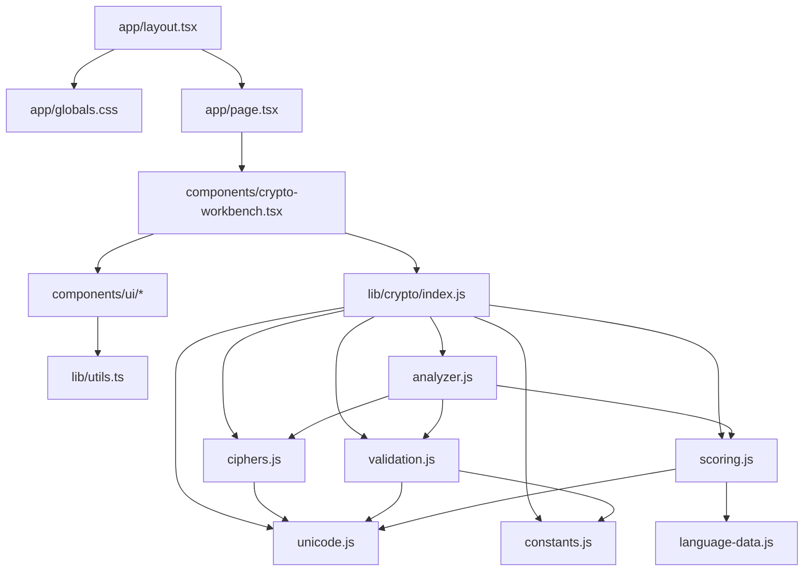

# Arquitectura real

## Diagrama de dependencias

La configuracion de plataforma tampoco aparece en la llamada de UI. `next.config.ts` selecciona entre servidor local y exportacion estatica; `vite.config.ts`, `tsconfig.json` y `package.json` configuran construccion y resolucion. El workflow de Pages ejecuta el build estatico fuera del navegador.

## Carpetas

- `app/`: documento, ruta y tema global.
- `components/`: experiencia y primitivas reutilizables.
- `lib/crypto/`: dominio independiente de React.
- `lib/`: utilidad de clases.
- `scripts/`: normalizacion y comprobacion del artefacto de Pages.
- `.github/workflows/`: automatizacion de publicacion.
- raiz: plataforma, build, tipos, dependencias y Git.

## Responsabilidades por archivo

| Archivo | Responsabilidad |
|---|---|
| `layout.tsx` | raiz/metadatos/CSS |
| `page.tsx` | entrada de ruta |
| `crypto-workbench.tsx` | estado, eventos, presentacion |
| `ui/*` | controles accesibles/estilos |
| `unicode.js` | NFC y grafemas |
| `validation.js` | invariantes y presupuesto |
| `ciphers.js` | transformaciones puras |
| `language-data.js` | datos de español |
| `scoring.js` | funcion de evaluacion |
| `analyzer.js` | candidatos, ranking, confianza |
| `index.js` | API publica |
| `next.config.ts` | exportacion estatica, prefijo y cabeceras de servidor |
| `scripts/build-pages.mjs` | construye y valida el artefacto estatico |
| `.github/workflows/pages.yml` | publica el artefacto en Pages |

## Flujo de datos

Los campos actualizan estado React. La UI valida para retroalimentacion y pasa cadenas al motor. La biblioteca vuelve a validar en la API de analisis. Las transformaciones devuelven strings; scoring devuelve datos numericos; analyzer reduce todo a una respuesta; React la renderiza como texto.

## Separacion de responsabilidades

La UI no contiene formulas. Cifrados no conocen español. Scoring no genera claves. Analizador no renderiza. La configuracion de despliegue no conoce mensajes. Esta direccion evita ciclos y hace que una capa pueda cambiar con impacto localizado.

## Imports y exports

La UI usa alias `@/`. El motor usa rutas ESM relativas con `.js`. `lib/crypto/index.js` reexporta API publica y oculta helpers privados.

## Si se elimina una capa

- Sin `unicode.js`, validacion/cifrados/scoring no cargan.
- Sin `validation.js`, analyzer no carga y se pierden invariantes.
- Sin `ciphers.js`, no hay transformaciones ni candidatos.
- Sin `scoring.js`, no puede seleccionarse automaticamente.
- Sin `analyzer.js`, se puede cifrar pero no inferir.
- Sin `CryptoWorkbench`, la ruta importa un modulo inexistente.
- Sin `globals.css`, la app puede renderizar sin tema/utilidades generadas correctamente.
- Sin `next.config.ts`, desaparecen la exportacion para Pages y las cabeceras configuradas al servir localmente.
- Sin `scripts/build-pages.mjs`, el build genera recursos en una estructura que no coincide con la raiz del artefacto de Pages.
- Sin el workflow, el sitio puede ejecutarse localmente, pero GitHub no recibe ningun artefacto publicable.

El analisis completo archivo por archivo esta en `CODIGO/`; las consecuencias detalladas estan en `20_DEPENDENCIAS_ENTRE_ARCHIVOS.md`.
