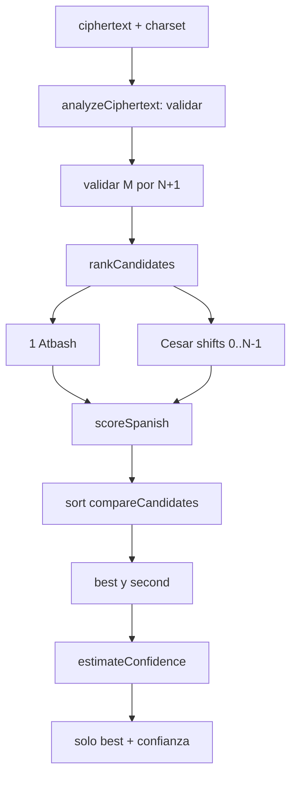

# Descifrado automatico

## Pipeline real



## Entrada y validacion

`CryptoWorkbench.decryptAutomatically` pasa dos strings a `analyzeCiphertext`. Este llama `validateCharset`, `validateMessage` y `validateAnalysisComplexity`. Si hay errores lanza `InputValidationError`; la UI lo captura.

## Generacion

`rankCandidates(ciphertext, charset)` crea `candidates=[]`. Transforma Atbash, puntua y guarda:

```js
{ algorithm:'atbash', shift:null, plaintext, analysis }
```

Luego un `for` recorre `shift=0; shift<charset.length; shift+=1`, llama `caesarDecrypt`, puntua y guarda. Total `N+1`.

## Scoring

Cada `analysis` contiene `score`, `evidence` y `details`. Las señales son frecuencia/log-verosimilitud/chi-cuadrada, lexico, n-gramas, vocales, espacios y penalizaciones.

## Orden y empates

`.sort(compareCandidates)` compara score mayor, palabras reconocidas mayores, Atbash primero y shift menor. En un comparador `right-left` produce descendente porque un resultado negativo coloca `left` primero.

## Mejor y segundo

`const [best, second] = ranked` usa desestructuracion de arreglo. `[0]` seria el mejor; `[1]`, segundo. El segundo solo alimenta el margen.

## Confianza

```text
margin = best.score - second.score
quality = clamp((best.score+35)/125)
separation = 1-exp(-max(0,margin)/15)
percentage = round(100*min(.98,.18+.34evidence+.22quality+.24separation))
```

Alta exige evidencia≥.62, margen≥12 y porcentaje≥72. Media exige evidencia≥.30, margen≥4 y porcentaje≥50. Resto baja.

## Retorno

`analyzeCiphertext` construye un objeto nuevo con algoritmo, shift, plaintext y confidence. No incluye candidatos ni details. `decryptAutomatically` lo guarda; JSX muestra solo esa linea.

## Ejemplo completo

Con preset español, texto original `ESTE PROYECTO ANALIZA FRECUENCIAS...` cifrado Cesar 7, se generan 28 candidatos. El actual ganador obtiene score `124.411539`; Atbash queda segundo con `-40.320494`; margen `164.732`; salida Cesar 7 y confianza alta 98 %. La traza completa esta en `26_TRAZAS_MANUALES.md`.

## Que puede salir mal

Texto corto, idioma diferente, nombres, ruido, conjunto incorrecto, otro algoritmo o candidatos equivalentes. El sistema devuelve el mejor bajo su modelo, no una demostracion de verdad.

## Complejidad

Prácticamente crece alrededor de `N*M` mas scoring/ordenamiento; memoria puede crecer `N*M` por conservar textos. El calculo se hace en el hilo principal.

La version aun mas detallada esta en `11_DESCIFRADO_AUTOMATICO.md` y `CODIGO/lib_crypto_analyzer_js.md`.
