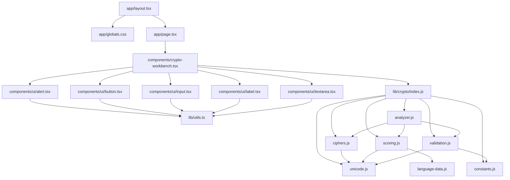

# Dependencias entre archivos

## Dependencias de herramientas

`package.json` declara paquetes/scripts; `package-lock.json` fija el arbol. `vite.config.ts` usa Vite/Vinext/Tailwind. `next.config.ts` es descubierto por Vinext y define cabeceras o exportacion segun entorno. `scripts/build-pages.mjs` invoca el build y normaliza su salida. `.github/workflows/pages.yml` depende de GitHub Actions. `tsconfig.json` define tipos/alias y `.gitignore` gobierna Git.

## Si se elimina cada archivo

| Archivo | Consecuencia principal |
|---|---|
| `.gitignore` | app corre, pero Git muestra dependencias/build/env locales |
| `app/globals.css` | import falla o desaparece tema/estilo |
| `app/layout.tsx` | falta raiz/metadatos/carga global |
| `app/page.tsx` | desaparece ruta principal |
| `crypto-workbench.tsx` | `page` no resuelve; no hay UI |
| `ui/alert.tsx` | falla import de errores |
| `ui/button.tsx` | fallan todas las acciones |
| `ui/input.tsx` | fallan conjunto/shift |
| `ui/label.tsx` | falla import y asociaciones visibles |
| `ui/textarea.tsx` | fallan entradas de mensajes |
| `analyzer.js` | cifrado manual queda, descifrado automatico no |
| `ciphers.js` | no hay Cesar/Atbash ni candidatos |
| `constants.js` | validacion/UI pierden limites/presets |
| `index.js` | la UI pierde su punto de importacion |
| `language-data.js` | scoring no puede cargar datos |
| `scoring.js` | analyzer no puede decidir ganador |
| `unicode.js` | se rompen validacion, cifrados y scoring |
| `validation.js` | analyzer no carga y faltan invariantes |
| `lib/utils.ts` | componentes UI no resuelven clases |
| `package-lock.json` | instalacion menos reproducible; npm puede regenerarlo |
| `package.json` | no hay scripts/dependencias/identidad ESM |
| `next.config.ts` | se pierden cabeceras de servidor y exportacion correcta para Pages |
| `scripts/build-pages.mjs` | no se normaliza ni valida el artefacto estatico |
| `.github/workflows/pages.yml` | no hay publicacion automatica |
| `tsconfig.json` | se pierden reglas de tipos/alias; build puede fallar |
| `vite.config.ts` | se pierden plugins Vinext/Tailwind |

## Direccion de dependencia

Datos/utilidades apuntan hacia orquestadores, no al reves. El motor no importa React. No existen ciclos internos observados. `index.js` amplia accesibilidad, pero no cambia la direccion real entre implementaciones.

## Archivos sin import explicito

Layout, page y configuraciones se descubren por convencion de plataforma. El workflow se descubre por su ubicacion en `.github/workflows/`. Ausencia de una llamada desde UI no significa que no se usen.
