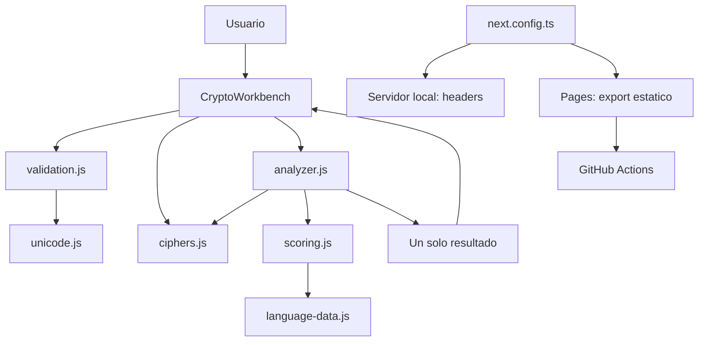

# Mapa del sistema

## Idea central

El proyecto es una aplicación web local que separa la [[14 - Estado e interfaz]] del motor criptográfico. El motor no conoce el DOM; recibe strings y devuelve datos.

## Capas

| Capa | Responsabilidad | Nota |
| --- | --- | --- |
| Presentación | Formularios y resultados | [[14 - Estado e interfaz]] |
| Validación | Reglas de entrada y complejidad | [[12 - Validacion y limites]] |
| Texto | NFC y segmentación | [[11 - Unicode NFC y grafemas]] |
| Cifrado | Transformaciones reversibles | [[04 - Cifrado Cesar]], [[05 - Cifrado Atbash]] |
| Criptoanálisis | Generación y selección | [[03 - Descifrado automatico]] |
| Lenguaje | Frecuencias, n-gramas y léxico | [[07 - Scoring del español]] |
| Seguridad web | CSP y headers | [[17 - XSS CSP y headers]] |
| Publicación | Exportación y workflow | [[32 - Publicacion en GitHub Pages]] |

## Principio de diseño

Separar las capas hace posible razonar sobre cada propiedad:

- el cifrado puede probarse sin navegador;
- la interfaz no implementa fórmulas criptográficas;
- la validación es consistente;
- el detector no muestra candidatos perdedores;
- las defensas HTTP están centralizadas.

## Siguiente paso

Recorre [[02 - Flujo de cifrado]] y luego [[03 - Descifrado automatico]].
