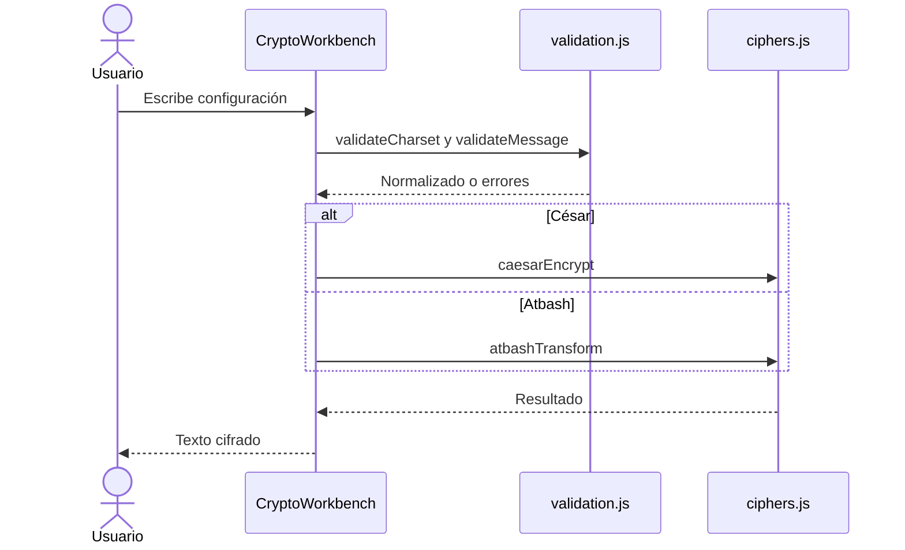

# Flujo de cifrado

## Entradas

1. Texto original.
2. [[10 - Charset personalizado]].
3. Método: [[04 - Cifrado Cesar]] o [[05 - Cifrado Atbash]].
4. Desplazamiento cuando el método es César.

## Secuencia

## Código conectado

- `encryptMessage` vive en `components/crypto-workbench.tsx`.
- La normalización se delega a [[11 - Unicode NFC y grafemas]].
- Las precondiciones pertenecen a [[12 - Validacion y limites]].
- `lib/crypto/index.js` funciona como fachada de exportaciones.

## Propiedades importantes

- Los caracteres fuera del charset no cambian.
- Los resultados se guardan en memoria.
- El desplazamiento se normaliza al tamaño real `N`.
- El botón Copiar actúa solo por una acción explícita.
- Los errores se muestran como texto y no como HTML.

## Relacionado

[[03 - Descifrado automatico]] toma el ciphertext resultante, pero no recibe el método ni el desplazamiento.
