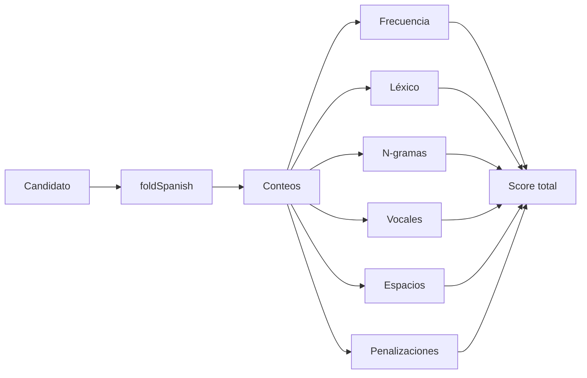

# Scoring del español

## Objetivo

Convertir un plaintext candidato en un número comparable. Un score mayor significa “más compatible con español según este modelo”, no “verdadero con certeza”.

## Pipeline



## Fórmula agregada

```text
score = frequency
      + lexical
      + ngramScore
      + vowelScore
      + spaceScore
      - structurePenalty
      - controlPenalty
```

## `foldSpanish`

- minúsculas con locale español;
- elimina diacríticos para comparar palabras;
- preserva `ñ` mediante un marcador temporal.

## Resultado

```js
{
  score,
  evidence,
  details: {
    letters, words, recognizedWords,
    chiSquare, frequency, lexical,
    ngrams, vowel, spaces, penalties
  }
}
```

`details` sirve para auditoría y desempate interno. La interfaz solo muestra el plaintext y la confianza.

## Conexiones

- Fundamento: [[06 - Al-Kindi y analisis de frecuencias]].
- Estadística: [[08 - Chi-cuadrada y log-verosimilitud]].
- Contexto local: [[09 - N-gramas y señales lingüisticas]].
- Consumidor: [[03 - Descifrado automatico]].
- Límite: [[18 - Ambiguedad y confianza]].
- Valores exactos: [[31 - Parametros del detector]].
