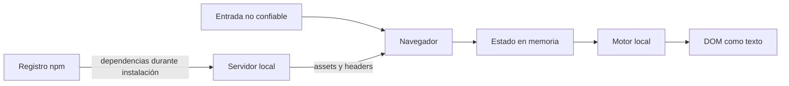

# Modelo de amenazas

## Activos

- texto escrito por el usuario;
- integridad del resultado;
- disponibilidad de la interfaz;
- código fuente y dependencias;
- confianza del usuario en el propósito educativo.

## Fronteras

## Amenazas

| Amenaza | Impacto | Mitigación | Residual |
| --- | --- | --- | --- |
| DOM XSS | Ejecución de código | JSX como texto, CSP | Cambio futuro a HTML crudo |
| HTML injection | DOM manipulado | Sin sinks HTML | Dependencia comprometida |
| Entrada gigante | Bloqueo de UI | Límites y costo máximo | Cálculo síncrono |
| Unicode inesperado | Resultado inconsistente | NFC y grafemas | Homoglifos |
| Clickjacking | Clic inducido | `frame-ancestors`, `DENY` | Hosting debe conservar headers |
| Exfiltración | Pérdida de privacidad | Sin red en el flujo | Extensión/equipo comprometido |
| Supply chain | Código malicioso | Lockfile y auditoría | Riesgo npm no nulo |
| Resultado falso | Decisión incorrecta | Score multiseñal y confianza | Ambigüedad inevitable |
| Uso inapropiado | Falsa seguridad | Aviso visible | Ingeniería social |

## Fuera de alcance

- malware local;
- extensiones maliciosas;
- navegador comprometido;
- sistema operativo comprometido;
- protección criptográfica real del mensaje.

## Conexiones

- [[17 - XSS CSP y headers]]
- [[19 - Privacidad y procesamiento local]]
- [[12 - Validacion y limites]]
- [[21 - Limitaciones y mejoras]]
