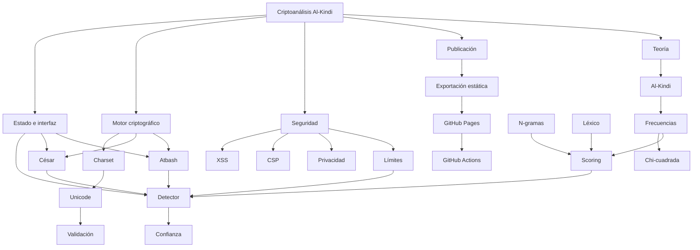

# Red de conocimiento

Esta es la “red neuronal” conceptual del proyecto: nodos de conocimiento y relaciones explícitas. No es una red neuronal de aprendizaje automático.

## Navegación por relaciones

- [[10 - Charset personalizado]] depende de [[11 - Unicode NFC y grafemas]].
- [[12 - Validacion y limites]] protege [[03 - Descifrado automatico]].
- [[06 - Al-Kindi y analisis de frecuencias]] fundamenta [[07 - Scoring del español]].
- [[08 - Chi-cuadrada y log-verosimilitud]] y [[09 - N-gramas y señales lingüisticas]] alimentan el score.
- [[14 - Estado e interfaz]] expone [[02 - Flujo de cifrado]] y el detector.
- [[17 - XSS CSP y headers]] protege la salida web.
- [[18 - Ambiguedad y confianza]] limita las afirmaciones del detector.
- [[32 - Publicacion en GitHub Pages]] conecta configuración, artefacto y despliegue.

## Centro recomendado del Graph

Usa [[00 - Inicio]] como nodo inicial y [[01 - Mapa del sistema]] como hub técnico.
