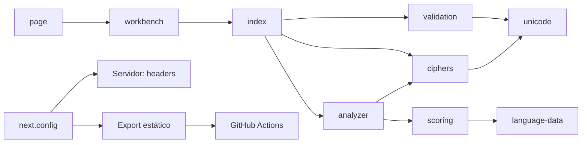

# Archivo por archivo

## `app/`

- `layout.tsx`: HTML raíz, idioma, metadatos y CSS global.
- `page.tsx`: renderiza `CryptoWorkbench`.
- `globals.css`: tokens visuales y reglas base.

## `components/`

- `crypto-workbench.tsx`: estado, handlers y composición completa de la pantalla.
- `ui/alert.tsx`: mensajes de error accesibles.
- `ui/button.tsx`: variantes y tamaños.
- `ui/input.tsx`: charset y shift.
- `ui/label.tsx`: etiquetas asociadas.
- `ui/textarea.tsx`: mensajes de entrada.

## `lib/crypto/`

- `index.js`: reexporta la API.
- `constants.js`: presets y límites.
- `unicode.js`: `normalizeUnicode`, `toGraphemes`.
- `validation.js`: `validateCharset`, `validateMessage`, `validateAnalysisComplexity`, `InputValidationError`.
- `ciphers.js`: `normalizeShift`, `transform`, `caesarEncrypt`, `caesarDecrypt`, `atbashTransform`.
- `language-data.js`: frecuencias, léxico, n-gramas y penalizaciones.
- `scoring.js`: `foldSpanish`, `countMatches`, `scoreSpanish`.
- `analyzer.js`: `compareCandidates`, `estimateConfidence`, `rankCandidates`, `analyzeCiphertext`.

## Raíz

- `lib/utils.ts`: combina clases Tailwind.
- `next.config.ts`: headers de servidor y exportación para Pages.
- `package.json`: scripts y dependencias.
- `package-lock.json`: versiones exactas.
- `vite.config.ts`: Vinext y Tailwind.
- `tsconfig.json`: compilación y tipos.
- `.gitignore`: evita subir dependencias, builds y secretos `.env`.

## Publicación

- `scripts/build-pages.mjs`: genera, normaliza y valida `dist/client`.
- `.github/workflows/pages.yml`: instala, compila, sube y despliega el artefacto.

## Relaciones

Continúa con [[01 - Mapa del sistema]] o la guía larga.
