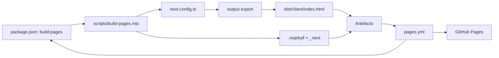

# Publicación en GitHub Pages

## Problema resuelto

El 404 ocurría porque GitHub Pages esperaba un archivo estático `index.html`, mientras el proyecto solo tenía el flujo de servidor Vinext. El repositorio ahora genera un artefacto estático reproducible y lo publica mediante GitHub Actions.

Sitio del proyecto:

<https://juanmanuelfriascortes.github.io/EncriptadoSeguridad1/>

## Red de archivos

## Dos contratos

| Comando | Destino | Resultado |
| --- | --- | --- |
| `npm run build` | local/servidor | build Vinext y headers configurables |
| `npm run build:pages` | hosting estático | `index.html`, `.nojekyll` y recursos prefijados |

El cifrado no cambia entre destinos: [[02 - Flujo de cifrado]] y [[03 - Descifrado automatico]] se ejecutan en el navegador.

## Ruta del repositorio

La aplicación no vive en `/`, sino en `/EncriptadoSeguridad1/`. `assetPrefix` escribe ese prefijo en scripts y CSS. El script mueve `_next` a la raíz del artefacto porque GitHub ya monta esa raíz bajo el nombre del repositorio.

## `.nojekyll`

GitHub Pages puede tratar directorios con guion bajo como especiales durante el procesamiento Jekyll. El archivo vacío `.nojekyll` indica que el artefacto debe servirse tal cual, incluido `_next`.

## Seguridad por entorno

- Vinext local: `headers()` aporta CSP, COOP, CORP, permisos, referrer, `nosniff` y `DENY`.
- GitHub Pages: HTTPS administrado por GitHub, pero sin esas cabeceras personalizadas.
- Ambos: React escapa texto, no hay `innerHTML`, no hay envío de mensajes y existen límites de entrada.

Relacionado: [[17 - XSS CSP y headers]] y [[19 - Privacidad y procesamiento local]].

## Comprobación

1. `npm run build:pages` debe terminar en cero.
2. `dist/client/index.html` y `.nojekyll` deben existir.
3. Ningún `href` o `src` prefijado debe apuntar a un archivo ausente.
4. El workflow `Publicar en GitHub Pages` debe verse verde.
5. La URL debe cargar y permitir un ciclo real de cifrado/descifrado.

## Riesgo de mantenimiento

Vinext está en beta. Si cambia su salida, el script falla deliberadamente antes de publicar. Tras actualizar dependencias hay que repetir [[20 - Desarrollo y verificacion]].

## Fuentes

- [GitHub: usar workflows personalizados con Pages](https://docs.github.com/es/pages/getting-started-with-github-pages/using-custom-workflows-with-github-pages)
- [GitHub: solucionar errores 404 de Pages](https://docs.github.com/es/pages/getting-started-with-github-pages/troubleshooting-404-errors-for-github-pages-sites)
- [Next.js: exportación estática](https://nextjs.org/docs/app/guides/static-exports)
